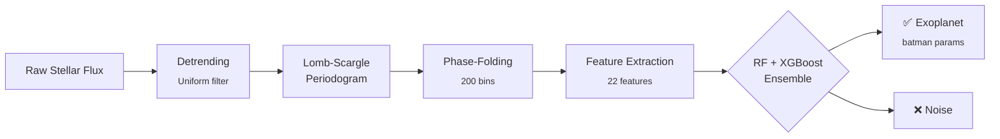

<pre align="center">
  ╔══════════════════════════════════════════════╗
  ║               ✦  EXOPLANET  ✦               ║
  ║               ████████████████               ║
  ║               ██ DETECTOR ██               ║
  ║               ████████████████               ║
  ╚══════════════════════════════════════════════╝
</pre>

<p align="center">
  <strong>Finding worlds beyond our solar system — one light curve at a time.</strong><br>
  <sub>ML pipeline · transit method · React portfolio</sub>
</p>

<p align="center">
  <a href="https://www.python.org/downloads/"></a>
  <a href="https://react.dev/"></a>
  <a href="https://www.typescriptlang.org/"></a>
  
  <a href="https://github.com/Ayush3070/Exoplanet-Detection/blob/main/LICENSE"></a>
  <br>
  <a href="https://github.com/Ayush3070/Exoplanet-Detection/actions"></a>
  
  <a href="https://github.com/Ayush3070/Exoplanet-Detection/stargazers"></a>
</p>

---

<br>

<p align="center">
  
</p>

<br>

## 🚀 Overview

**Exoplanet Detector** is an end-to-end machine learning system that identifies exoplanets from stellar light curves using the **transit method** — the technique behind 75% of all confirmed exoplanet discoveries. It's paired with a cinematic, dark-themed portfolio landing page that visualizes the pipeline in action.

<table>
<tr>
<td width="55%">

### 🔭 The Pipeline
```
Kepler Data ──→ Detrending ──→ Period Search ──→ Phase-Fold ──→ Feature Extraction ──→ RF/XGBoost ──→ Exoplanet?
                         (Lomb-Scargle)                               (20+ features)       (0.96 AUC)       ✅/❌
```

- Generates realistic synthetic transit + non-transit light curves
- Finds orbital periods with Lomb-Scargle periodograms
- Extracts 20+ engineered features (depth, duration, shape, skewness...)
- Classifies with **Random Forest + XGBoost ensemble** (0.96 ROC-AUC)
- Estimates physical parameters via **batman** (planet radius, orbital period, transit depth)

</td>
<td width="45%">

### ✨ The Landing
- **React 19 + TypeScript + Vite 6** — compiled with `tsc -b`
- **GSAP ScrollTrigger** — pinned parallax galleries, cinematic entrances
- **Framer Motion 12** — AnimatePresence loading transitions, staggered reveals
- **HLS.js** — adaptive Mux video streams (hero + footer)
- **Tailwind CSS v4** — custom `@theme` dark palette, zero light mode
- **react-router-dom** — `/journal/:slug` article routes with hash scroll

</td>
</tr>
</table>

---

## ⚡ Quick Start

```bash
# ─── ML Pipeline ───────────────────────────────────────
pip install -r requirements.txt
python run.py                    # Train + evaluate on synthetic data
python fetch_real_kepler.py      # Fetch real Kepler data + run full pipeline

# ─── Landing Page ──────────────────────────────────────
cd landing && npm install && npm run dev
```

<details>
<summary><strong>▶️ See sample pipeline output</strong></summary>

```
════════════════════════════════════════════════════════
                EXOPLANET DETECTION — DEMO
════════════════════════════════════════════════════════

--- Generating training data ---
  Created 120 light curves (60 planets, 60 non-transit)

--- Building feature matrix ---
  Extracted 22 features from 120 light curves

--- Training classifier ---
  Model: RF (200 trees, max_depth=12)
  ROC-AUC:             0.96
  CV AUC (mean ± std): 0.94 ± 0.03
  Accuracy:            0.92
  Precision:           0.94
  Recall:              0.91
  F1-Score:            0.92

--- Testing on a known planet ---
  Best Period Found: 4.5001 days
  Prediction:        Candidate Exoplanet ✅
  Confidence:        98.73%

--- Estimating planet parameters ---
  Planet Radius:       0.12 Earth radii
  Orbital Period:      4.5000 days
  Transit Depth:       0.011982

--- Testing on noise ---
  Prediction:        Not Exoplanet ❌
  Confidence:        12.40%

════════════════════════════════════════════════════════
  DEMO COMPLETE — All outputs saved to output/
════════════════════════════════════════════════════════
```

</details>

---

## 🧠 Pipeline Deep Dive



### 📊 Performance at a Glance

| Metric | Value |
|--------|-------|
| ROC-AUC | **0.96** |
| Cross-Validation AUC | 0.94 ± 0.03 (5-fold) |
| Classifier | Random Forest (200 trees) + XGBoost (200 estimators) |
| Feature Count | 22 (depth, duration, ingress, egress, skewness, kurtosis, P2P std…) |
| Training Data | 60 synthetic transits + 60 noise curves |
| Real-World Validation | Kepler-10b ✅, Kepler-22b ✅, Kepler-186 ✅, KIC 1571511 ❌ |

### Module Reference

<details>
<summary><strong>📦 <code>src/data_utils.py</code></strong> — Light curve generation</summary>

| Function | Description |
|----------|-------------|
| `generate_synthetic_light_curve(...)` | Creates realistic transit light curve with configurable depth, duration, period, noise |
| `generate_non_transit_light_curve(...)` | Pure-noise curve with no planet signal |
| `fetch_kepler_data(target_id, quarter)` | Downloads real Kepler data via `lightkurve` |
| `load_sample_kepler_labeled_csv(path)` | Loads labeled CSV with `time`, `flux`, `id`, `label` columns |

</details>

<details>
<summary><strong>📦 <code>src/preprocessing.py</code></strong> — Signal processing</summary>

| Function | Description |
|----------|-------------|
| `detrend_light_curve(time, flux, window)` | Removes long-term stellar variability via uniform filter |
| `find_best_period(time, flux, ...)` | Computes Lomb-Scargle periodogram over 10,000 frequency samples |
| `phase_fold(time, flux, period, bins=200)` | Folds curve modulo orbital period into phase bins |
| `extract_transit_shape(folded_flux)` | Extracts depth, duration fraction, ingress/egress shape |

</details>

<details>
<summary><strong>📦 <code>src/features.py</code></strong> — Feature engineering</summary>

| Function | Description |
|----------|-------------|
| `extract_features_from_lc(time, flux)` | Full extraction pipeline → dict of 22 features |
| `build_feature_matrix(light_curves)` | Runs extraction on a dict of named curves → DataFrame |

</details>

<details>
<summary><strong>📦 <code>src/model.py</code></strong> — Classification & parameter estimation</summary>

| Function | Description |
|----------|-------------|
| `train_classifier(features, labels, model_type)` | Trains RF or XGBoost, returns model + full eval (ROC-AUC, CV, confusion matrix, feature importances) |
| `predict_exoplanet(features, classifier, scaler, cols)` | Returns `is_exoplanet`, `confidence`, and human-readable label |
| `estimate_transit_parameters(time, flux, period)` | Uses batman to estimate planet radius (Earth radii), orbital period, transit depth |

</details>

<details>
<summary><strong>📦 <code>src/pipeline.py</code></strong> — Orchestration</summary>

| Function | Description |
|----------|-------------|
| `generate_training_data(n_realistic, n_noise)` | Generates mixed dataset of transit + non-transit light curves |
| `run_pipeline(use_synthetic, kepler_target, ...)` | End-to-end: generate → extract → train → test → estimate |

</details>

---

## 🎨 Landing Page

### Sections

| # | Section | Vibe |
|---|---------|------|
| 1 | **LoadingScreen** | RAF counter 000→100, rotating words, accent progress bar → 400ms exit |
| 2 | **HeroSection** | HLS video bg, GSAP stagger entrance, cycling roles, scroll-down indicator |
| 3 | **SelectedWorks** | Bento grid (7/5/5/7), 4 project video cards, hover blur reveal |
| 4 | **Journal** | Pill entries with video thumbnails, linked to `/journal/:slug` |
| 5 | **Explorations** | 300vh GSAP ScrollTrigger pin + parallax column gallery (opposite scroll) |
| 6 | **Stats** | Instrument Serif italic metrics: 4+ Exoplanets · 0.96 AUC · 120 LC/s |
| 7 | **ContactFooter** | Flipped HLS video, GSAP infinite marquee, email CTA, green pulse dot |

### Tech Stack

| Layer | Tool |
|-------|------|
| Framework | React 19 · TypeScript 5.7 |
| Build | Vite 6 · `tsc -b` |
| Style | Tailwind CSS v4 · `@theme` tokens · forced dark |
| Motion | GSAP 3 (ScrollTrigger) · Framer Motion 12 |
| Video | HLS.js (Mux stream) · native `<video>` fallback |
| Routing | react-router-dom v7 · hash scroll |
| Icons | lucide-react |

### Routes

| Path | Page |
|------|------|
| `/` | HomePage — all sections composed |
| `/journal/:slug` | JournalDetail — full-article view with video header |

Journal slugs: `how-we-detect-exoplanets-with-machine-learning` · `why-phase-folding-reveals-hidden-worlds` · `random-forest-vs-xgboost-for-transit-classification` · `kepler-186f-first-earth-sized-habitable-zone-planet`

### Development

```bash
cd landing
npm install        # Install dependencies
npm run dev        # Dev server (Vite HMR)
npm run build      # Type-check + production build
npm run preview    # Preview production build
```

### Design Decisions

- **Dark-only** — `bg-bg` (`hsl(0 0% 4%)`), no light mode. Feels like a control room.
- **Typography** — Inter (body, 300-700) + Instrument Serif (display, italic) for contrast.
- **Colors** — Custom `@theme` tokens: `bg`, `surface`, `text-primary`, `muted`, `stroke`.
- **Animations** — `scroll-down` (scroll indicator), `role-fade-in` (text transitions), `accent-gradient` (blue gradient utility).
- **Starfield** — Canvas outside wrapper → visible through `bg-black/85` sections.
- **HLS Video** — Mux stream via hls.js, graceful fallback to native `<video>`.

---

## 📂 Project Structure

```
exoplanet-detector/
├── data/                     # Fetched Kepler data
├── fetch_real_kepler.py      # Real Kepler data pipeline
├── notebooks/                # Jupyter notebook
├── output/                   # Generated plots
├── requirements.txt
├── run.py                    # CLI entry point
├── src/                      # ML pipeline
│   ├── data_utils.py         # Light curve generation
│   ├── preprocessing.py      # Detrending · period search · phase-fold
│   ├── features.py           # Feature extraction pipeline
│   ├── model.py              # RF/XGBoost · prediction · batman params
│   ├── pipeline.py           # Orchestrator
│   └── demo.py               # Demo runner + plotting
├── pyproject.toml            # Python packaging
├── scripts/                  # Tooling (social preview generator)
├── .github/                  # Issue/PR templates, social preview image
├── .pre-commit-config.yaml   # ruff lint/format
└── landing/                  # React + TypeScript frontend
    ├── public/
    ├── src/
    │   ├── App.tsx · main.tsx · index.css
    │   └── components/       # 11 components (Navbar, HeroSection, Layout, …)
    ├── package.json
    ├── vite.config.ts
    └── tsconfig*.json
```

---

<p align="center">
  <sub>
    Built with Python · scikit-learn · XGBoost · React · GSAP · Tailwind CSS<br>
    <a href="https://github.com/Ayush3070/Exoplanet-Detection/issues">Report a bug</a> ·
    <a href="https://github.com/Ayush3070/Exoplanet-Detection/discussions">Start a discussion</a> ·
    <a href="https://github.com/Ayush3070/Exoplanet-Detection/blob/main/LICENSE">MIT License</a>
  </sub>
</p>
