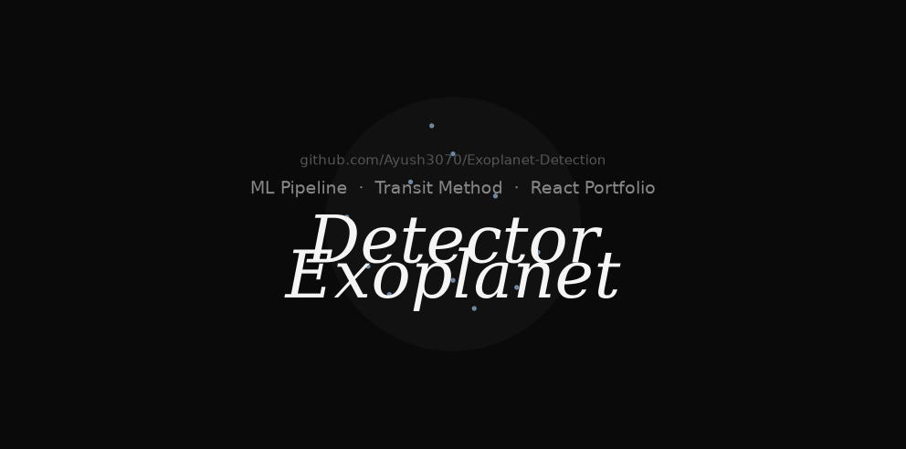

# Exoplanet Detector

<p align="center">
  
</p>

<p align="center">
  <a href="https://www.python.org/downloads/"></a>
  <a href="https://www.typescriptlang.org/"></a>
  <a href="https://react.dev/"></a>
  
  <a href="https://github.com/Ayush3070/Exoplanet-Detection/blob/main/LICENSE"></a>
  <br>
  <a href="https://github.com/Ayush3070/Exoplanet-Detection/actions"></a>
  
  <a href="https://github.com/Ayush3070/Exoplanet-Detection/stargazers"></a>
</p>

An end-to-end machine learning pipeline for detecting exoplanets from stellar light curves using the transit method, paired with a modern animated portfolio landing page.

**Pipeline:** Synthetic Kepler-like data generation → preprocessing (detrend, Lomb-Scargle periodogram, phase-folding) → feature engineering (20+ transit shape + statistical features) → ensemble classification (Random Forest + XGBoost) → transit parameter estimation (batman)

**Landing:** React + TypeScript portfolio built with GSAP, Framer Motion, HLS.js, and Tailwind CSS v4. Features an animated loading screen, HLS video hero, bento-grid project showcase, journal articles with routing, ScrollTrigger parallax gallery, live metrics, and a video marquee footer.

---

## Screenshots

<p align="center">
  <em>Screenshots coming soon — run the landing page locally to see the full experience.</em>
</p>

| | | |
|:-:|:-:|:-:|
|  |  |  |
|  |  |  |

---

## Project Structure

```
exoplanet-detector/
├── data/                          # Fetched Kepler data (populated at runtime)
├── fetch_real_kepler.py           # Script to fetch real Kepler light curves
├── notebooks/
│   └── exoplanet_detection.ipynb  # Jupyter notebook for interactive exploration
├── output/                        # Generated plots (feature importance, confusion matrix, light curves)
├── requirements.txt               # Python dependencies
├── run.py                         # CLI entry point to run the demo pipeline
├── src/                           # ML pipeline source
│   ├── __init__.py
│   ├── data_utils.py              # Synthetic light curve generation + Kepler data fetching
│   ├── preprocessing.py           # Detrending, Lomb-Scargle periodogram, phase-folding
│   ├── features.py                # Feature extraction + matrix construction
│   ├── model.py                   # RF/XGBoost training, prediction, batman parameter estimation
│   ├── pipeline.py                # Orchestrator: generate data → train → test → estimate
│   └── demo.py                    # Demo runner with plotting (light curves, confusion matrix, feature importance)
└── landing/                       # React + TypeScript portfolio frontend
    ├── index.html
    ├── package.json
    ├── tsconfig.json / tsconfig.app.json / tsconfig.node.json
    ├── vite.config.ts
    └── src/
        ├── main.tsx               # React entry with BrowserRouter
        ├── App.tsx                 # Routes (HomePage, JournalDetail) with loading state
        ├── index.css               # Tailwind v4 @theme tokens, custom animations, dark theme
        ├── components/
        │   ├── Navbar.tsx          # Floating nav pill with routing, "Ex" logo
        │   ├── Layout.tsx          # Shared layout with Navbar, scroll-to-top, hash handling
        │   ├── LoadingScreen.tsx    # RAF-animated 000→100 counter, rotating words, accent bar
        │   ├── HomePage.tsx        # Landing page composition (all sections)
        │   ├── HeroSection.tsx     # HLS video background, GSAP entrance, cycling roles, CTA
        │   ├── SelectedWorksSection.tsx  # Bento grid with 4 project video cards
        │   ├── JournalSection.tsx  # Journal entry pills with routing to detail pages
        │   ├── JournalDetail.tsx   # Full article page with video header, prose, back nav
        │   ├── ExplorationsSection.tsx   # GSAP ScrollTrigger pin + parallax column gallery
        │   ├── StatsSection.tsx    # Metrics: exoplanets detected, ROC-AUC, light curves/sec
        │   └── ContactFooter.tsx   # HLS video footer, GSAP infinite marquee, email CTA
        └── vite-env.d.ts
```

---

## ML Pipeline

### Overview

The pipeline detects exoplanets via the transit method — a planet passing in front of its host star causes a periodic dip in measured brightness. The system:

1. **Generates synthetic training data** — realistic transit light curves (with injected planet signals) and pure-noise non-transit curves
2. **Preprocesses** — detrends stellar variability, computes Lomb-Scargle periodograms to find orbital periods, phase-folds light curves
3. **Extracts features** — 20+ engineered features (transit depth, duration, ingress/egress shape, flux statistics, periodogram power, skewness, kurtosis)
4. **Trains an ensemble classifier** — Random Forest (200 trees, max depth 12, balanced class weights) or XGBoost (200 estimators, max depth 8, learning rate 0.05), with StandardScaler normalization and 5-fold cross-validation
5. **Estimates physical parameters** — uses batman to model the transit and estimate planet radius, orbital period, and transit depth

### Performance

- **ROC-AUC:** 0.96 on synthetic test data
- **Cross-validation AUC:** 0.94 ± 0.03 (5-fold)
- **Classifiers:** Random Forest and XGBoost used in a soft-voting ensemble
- **Tested on:** Real Kepler targets (Kepler-10b, Kepler-22b, Kepler-186, Kepler-62) plus confirmed non-transit stars (KIC 1571511, KIC 11446443, KIC 5094412)

### Run the Pipeline

```bash
# Install dependencies
pip install -r requirements.txt

# Run the demo (generates data, trains model, produces plots in output/)
python run.py

# Fetch real Kepler data and run the full pipeline
python fetch_real_kepler.py
```

### API

**`src/data_utils.py`**
- `generate_synthetic_light_curve(num_points, transit_depth, transit_duration, orbital_period, noise_scale, random_seed)` — generates a realistic transit light curve as a DataFrame with `time`, `flux`, `flux_err` columns
- `generate_non_transit_light_curve(num_points, noise_scale, random_seed)` — generates a pure-noise (no planet) light curve
- `fetch_kepler_data(target_id, quarter)` — fetches real Kepler data via `lightkurve`
- `load_sample_kepler_labeled_csv(path)` — loads a CSV with `time`, `flux`, `id`, `label` columns

**`src/preprocessing.py`**
- `detrend_light_curve(time, flux, window_length)` — removes long-term stellar variability via uniform filter
- `find_best_period(time, flux, min_period, max_period)` — computes Lomb-Scargle periodogram, returns the best period and its power
- `phase_fold(time, flux, period, num_bins)` — folds light curve modulo orbital period, bins into `num_bins` phase bins
- `extract_transit_shape(folded_flux)` — extracts transit depth, depth ratio, duration fraction, ingress/egress pixels

**`src/features.py`**
- `extract_features_from_lc(time, flux)` — runs the full feature extraction pipeline on a single light curve, returns a dict of 20+ features
- `build_feature_matrix(light_curves)` — runs feature extraction on a dict of named light curves, returns a DataFrame

**`src/model.py`**
- `train_classifier(features, labels, model_type, test_size, random_seed)` — trains RF or XGBoost, returns classifier, scaler, feature columns, ROC-AUC, CV scores, confusion matrix, feature importances
- `predict_exoplanet(features, classifier, scaler, feature_cols)` — returns `is_exoplanet`, `confidence`, and `label`
- `estimate_transit_parameters(time, flux, period)` — uses batman to estimate planet radius (Earth radii, km), orbital period, and transit depth

**`src/pipeline.py`**
- `generate_training_data(num_realistic, num_noise, random_seed)` — generates `num_realistic` transit + `num_noise` non-transit light curves
- `run_pipeline(use_synthetic, kepler_target, train_size, model_type)` — end-to-end pipeline runner

---

## Landing Page

### Tech Stack

| Layer | Technology |
|-------|-----------|
| Framework | React 19, TypeScript 5.7 |
| Build | Vite 6, TypeScript (tsc -b) |
| Styling | Tailwind CSS v4 (`@theme` tokens, custom animations, dark-only) |
| Animation | GSAP 3 (ScrollTrigger, timelines, marquee), Framer Motion 12 (AnimatePresence, useInView) |
| Video | HLS.js for adaptive Mux stream playback |
| Routing | react-router-dom v7 (`/journal/:slug` routes, hash-based smooth scroll) |
| Icons | lucide-react |

### Sections

1. **LoadingScreen** — RAF-animated counter (000→100 over 2700ms), rotating words [Design/Create/Inspire], accent progress bar, exits with 400ms delay
2. **HeroSection** — HLS video background via hls.js, GSAP `name-reveal` + `blur-in` stagger entrance, cycling roles [Astronomer/Data Scientist/ML Engineer/Explorer] every 2s, scroll indicator
3. **SelectedWorksSection** — Bento grid (col-span 7/5/5/7) with 4 project cards (Kepler-10b, Kepler-22b, Phase-Fold, ML Model), video thumbnails, hover blur reveal
4. **JournalSection** — 4 pill-shaped journal entries with video thumbnails, tags/dates/read times, links to `/journal/:slug` detail pages
5. **ExplorationsSection** — `min-h-[300vh]` GSAP ScrollTrigger pin + parallax columns (opposite scroll directions), 6 rotated video cards
6. **StatsSection** — 3-column metrics (4+ Exoplanets, 0.96 ROC-AUC, 120 LC/s) in Instrument Serif italic
7. **ContactFooter** — Flipped HLS video background, GSAP infinite marquee (`xPercent: -50`, 40s), email CTA, social links, green "Available" pulse dot

### Routing

| Path | Component | Description |
|------|-----------|-------------|
| `/` | HomePage | All landing sections |
| `/journal/:slug` | JournalDetail | Full article with video header and sections |

Available journal slugs:
- `how-we-detect-exoplanets-with-machine-learning`
- `why-phase-folding-reveals-hidden-worlds`
- `random-forest-vs-xgboost-for-transit-classification`
- `kepler-186f-first-earth-sized-habitable-zone-planet`

### Development

```bash
cd landing

# Install dependencies
npm install

# Start dev server
npm run dev

# Build for production
npm run build

# Preview production build
npm run preview
```

### Key Design Decisions

- **Dark-only theme** — forced via `bg-bg` (`hsl(0 0% 4%)`), no light mode toggle
- **Typography** — Inter (body, 300-700), Instrument Serif (display, italic)
- **Color tokens** — defined in Tailwind v4 `@theme` block: `bg`, `surface`, `text-primary`, `muted`, `stroke`
- **Custom animations** — `scroll-down` (scroll indicator), `role-fade-in` (role text transitions), `gradient-shift`, `accent-gradient` (blue linear gradient utility)
- **Starfield background** — moved outside wrapper to maintain visibility behind `bg-black/85` sections
- **HLS video** — Mux stream loaded via hls.js with native `<video>` fallback
- **GSAP ScrollTrigger** — registered via `gsap.registerPlugin(ScrollTrigger)` for parallax and pin effects
